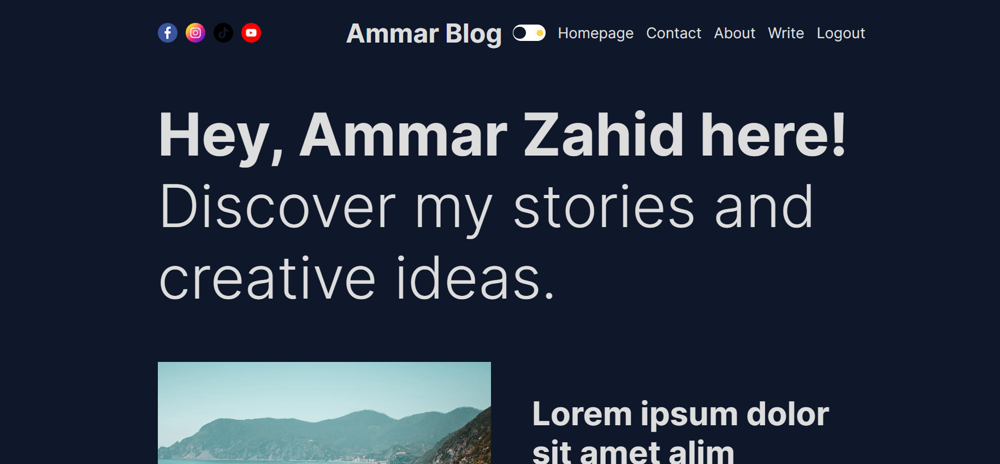
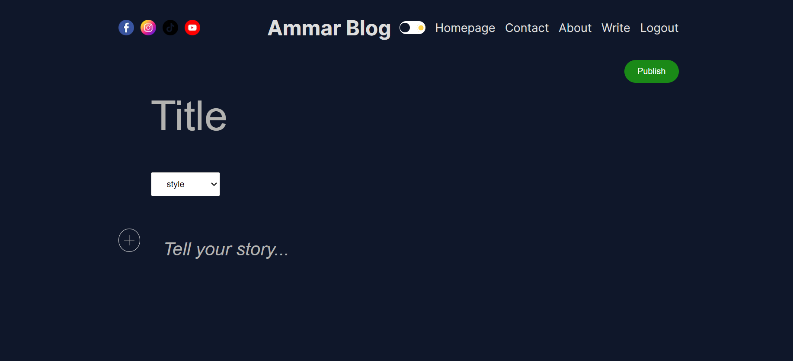
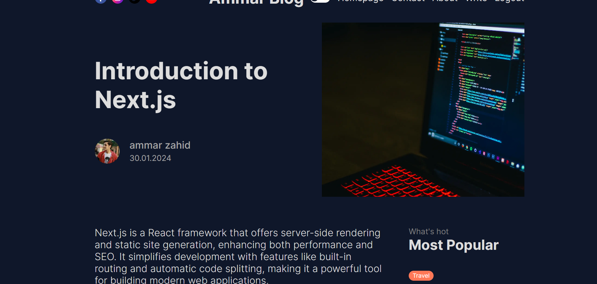
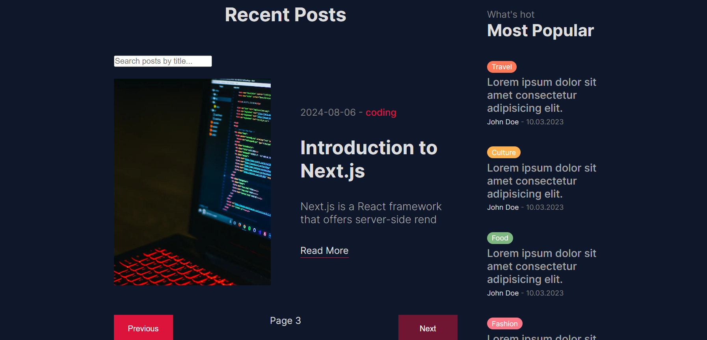
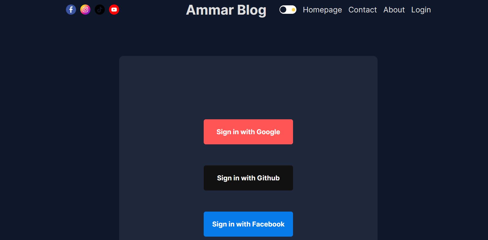
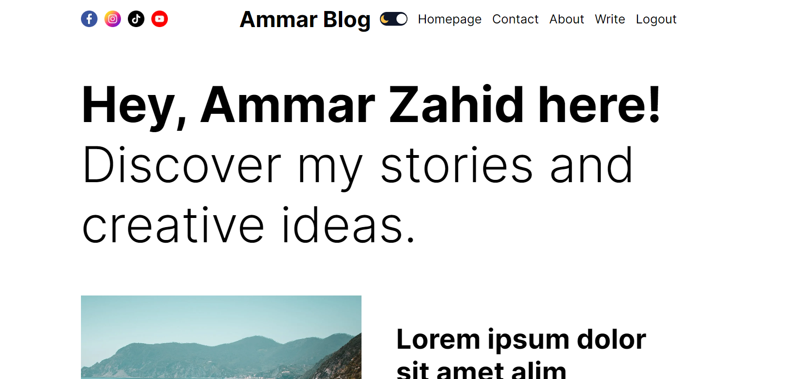
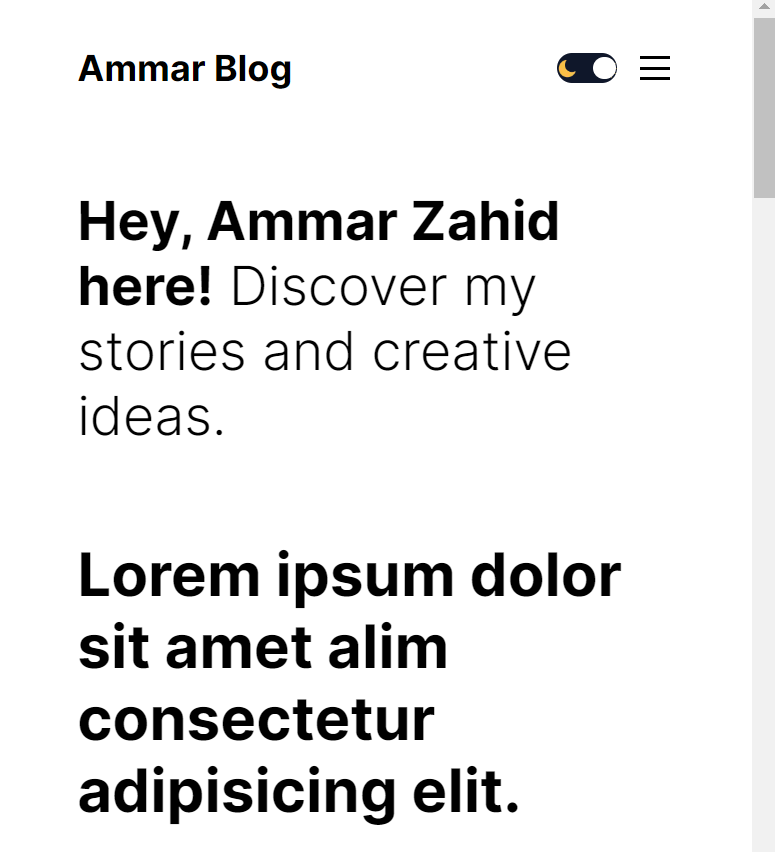
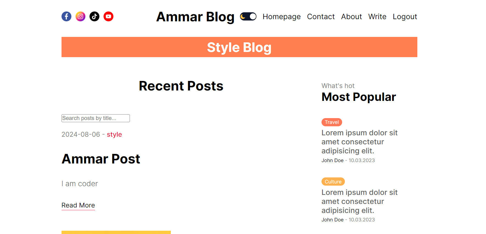
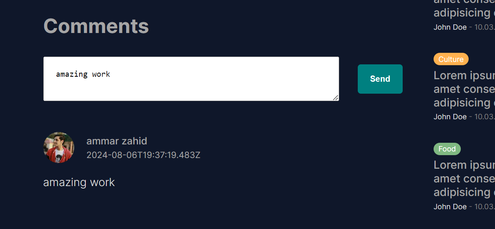

# Blog App

Welcome to the Blog App, a powerful and responsive blogging platform built with [Next.js](https://nextjs.org/). This application integrates several modern technologies to provide a rich and engaging user experience.

## Features

- **Pagination**: Efficiently navigate through posts with pagination.
- **Search Bar**: Quickly find posts by title with a built-in search functionality.
- **MongoDB**: Utilizes MongoDB for robust and scalable database management.
- **Firebase**: Handles file storage through Firebase for media and attachments.
- **Prisma**: Uses Prisma as an ORM to interact with the database.
- **Responsive Design**: Optimized for both desktop and mobile devices.
- **Clean Component Code**: Organized and maintainable code structure.
- **API Integration**: Includes well-defined APIs for various functionalities.
- **Google Authentication**: Allows users to log in using Google accounts.
- **Post Management**: Create, view, and manage posts with ease.
- **View Count**: Displays the number of views for each post.
- **Comments**: Users can comment on posts to engage in discussions.
- **Single Page Feature**: Click on any blog title to open that specific blog's detail page.
- **Filter by Category**: Filter posts by category to easily browse content related to specific topics.

## Getting Started

To get started with the project, follow these steps:

1. **Clone the Repository**:

    ```
    git clone https://github.com/ammar1zahid/Blog-App
    ```

2. **Navigate to the Project Directory**:

    ```
    cd your-repo
    ```

3. **Install Dependencies**:

    ```
    npm install
    # or
    yarn install
    # or
    pnpm install
    ```

4. **Set Up Environment Variables**:

    Create a `.env.local` file in the root of the project and add your environment variables. Example:

    ```
    GOOGLE_ID=your_google_client_id
    NEXTAUTH_URL=your_nextauth_url
    NEXTAUTH_SECRET=your_nextauth_secret

    DATABASE_URL=your_database_url

    FIREBASE=your_firebase_api_key
    ```

5. **Configure Image Domains**:

    To allow images from external domains, update your `next.config.js` file:

    ```js
    /** @type {import('next').NextConfig} */
    const nextConfig = {
        images: {
            domains: ["lh3.googleusercontent.com", "firebasestorage.googleapis.com"],
        },
    };

    module.exports = nextConfig;
    ```

6. **Run the Development Server**:

    ```
    npm run dev
    # or
    yarn dev
    # or
    pnpm dev
    ```

7. **Open the Application**:

    Open [http://localhost:3000](http://localhost:3000) in your browser to see the app in action.

## Usage

- **Login**: Use Google authentication to log in or create an account.
- **Create Posts**: Navigate to the "Write" page to create and publish new posts.
- **Search for Posts**: Use the search bar to find posts by title.
- **View Posts**: Browse posts with pagination and view post details.
- **Comment**: Add comments to posts to participate in discussions.
- **View Count**: See the number of views for each post to gauge popularity.
- **Single Page Feature**: Click on any blog title to access its dedicated detail page.
- **Filter by Category**: Use the category filter to view posts related to specific topics.

## Screenshots

Here are some screenshots of the application:

1. **Home Page**
   

2. **Write Page**
   

3. **Single Post Page**
   

4. **Posts Page**
   

5. **Login Page**
   

6. **Light Mode**
   

7. **Responsiveness**
   

8. **Category Wise Filter Page**
   

9. **Comments**
   

## Learn More

To learn more about the technologies used in this project, check out the following resources:

- [Next.js Documentation](https://nextjs.org/docs) - Learn about Next.js features and API.
- [MongoDB Documentation](https://docs.mongodb.com/) - Learn about MongoDB database features.
- [Firebase Documentation](https://firebase.google.com/docs) - Learn about Firebase services.
- [Prisma Documentation](https://www.prisma.io/docs) - Learn about Prisma ORM.
- [Google Authentication Documentation](https://developers.google.com/identity) - Learn about Google authentication.

## Deployment

To deploy the application, consider using [Vercel](https://vercel.com/) for seamless integration with Next.js. For more deployment options, refer to the [Next.js deployment documentation](https://nextjs.org/docs/deployment).

## Contributing

Feel free to contribute to this project by submitting issues, creating pull requests, or suggesting improvements. Your feedback and contributions are welcome!

## License

This project is licensed under the [MIT License](LICENSE).

## Developed by

**Ammar Zahid**

